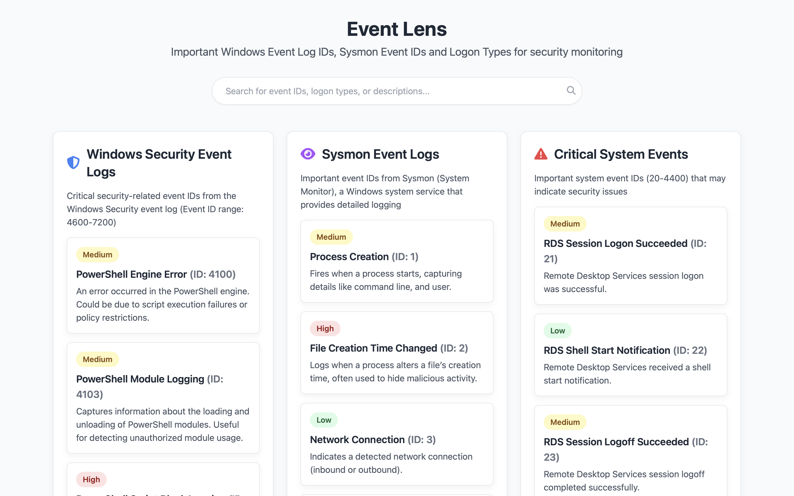
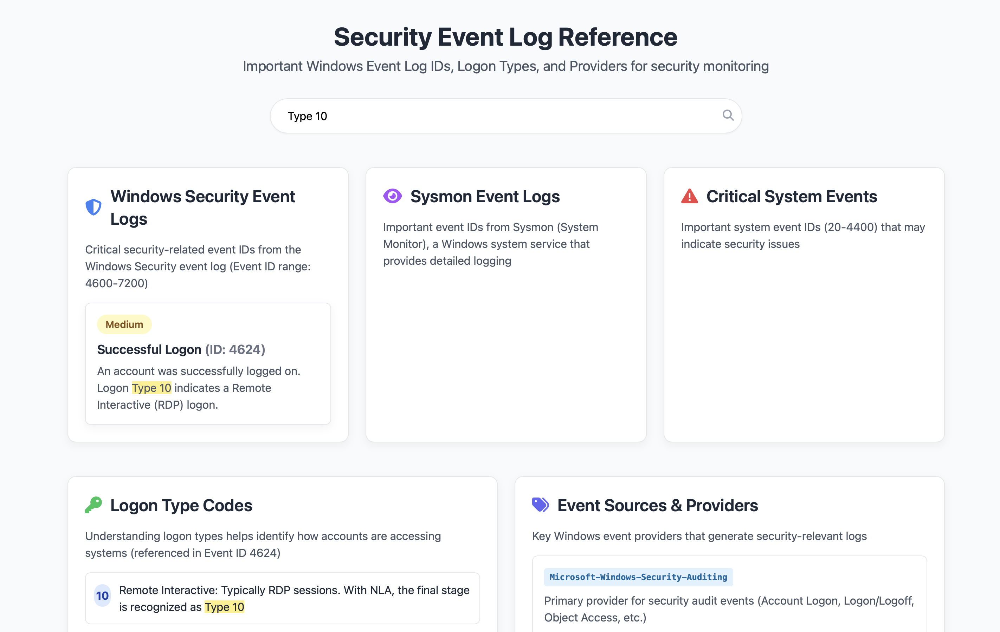
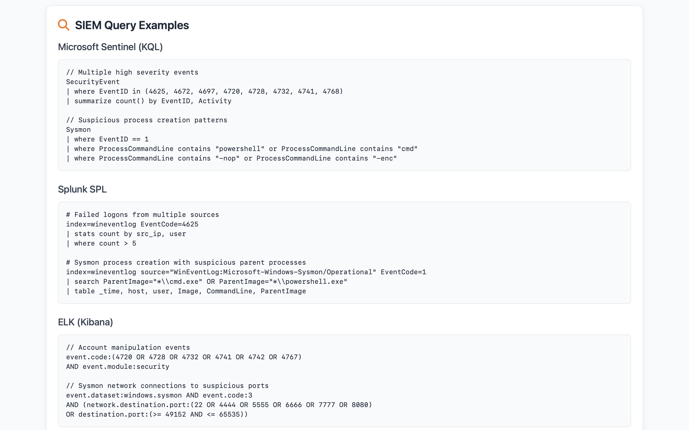
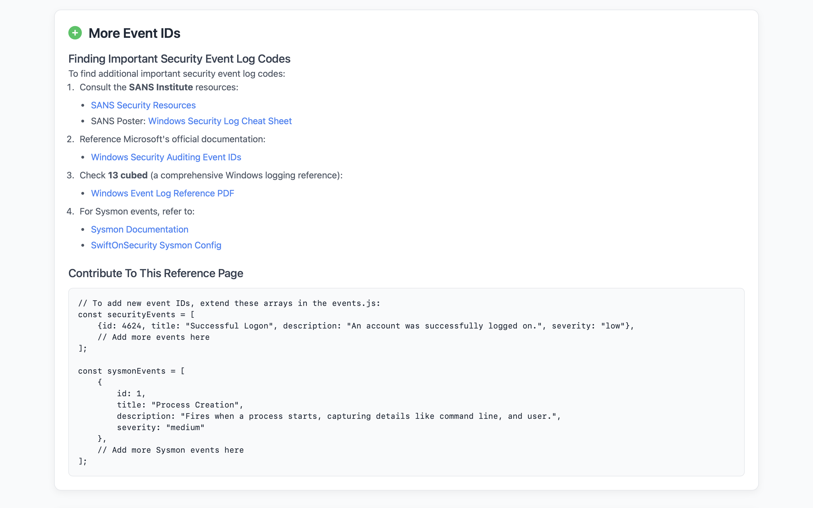

# EventLens

Event Lens provides a structured, searchable, and visually clean reference for critical Windows Security Event IDs. Helpful for blue teams and security analysts to quickly look up relevant log IDs along with severity and descriptions

## Preview

#### Home Page


#### Search Filter


#### SIEM Queries (More can be added manually)


#### More Resources


## Features

- Clean UI built with HTML, Tailwind CSS, and JavaScript
- Categorized and color-coded event severity (High, Medium, Low)
- Real-time search highlighting for quick filtering
- Covers essential event IDs for:
  - Logon attempts
  - RDP tracking
  - Privilege use
  - PowerShell execution
  - Kerberos authentication
  - System audit policy
  - Task creation and more

## Project Structure

```bash
.
├── index.html           # Main UI layout
├── style.css            # Styling for cards, layout, and highlighting
├── events.js            # Core event data (IDs, descriptions, severity)
├── search.js            # Handles DOM-safe text highlighting logic
├── main.js              # Event rendering logic
└── screenshots/         # Screenshots for documentation

```

Here's an updated **Credits** section for your `README.md` with proper acknowledgment of all key resources:

---

## Credits

This project was developed with inspiration and references from many security resources:

- **[Microsoft Security Documentation](https://learn.microsoft.com/en-us/windows/security/threat-protection/auditing/basic-security-audit-events)**  
  Comprehensive details on Windows Security Audit Events and Event ID explanations

- **[SANS Blue Team Tools & Cheatsheets](https://www.sans.org/blue-team/)**  
  For SIEM query examples and extra tips mentioned on the page

- **[13Cubed – Security Investigations & Deep Dives](https://www.youtube.com/c/13Cubed)**  
  High-quality educational content on Windows event analysis, forensic workflows, and threat hunting

> This project was heavily inspired by the Windows Event Log Cheatsheet from 13Cubed
